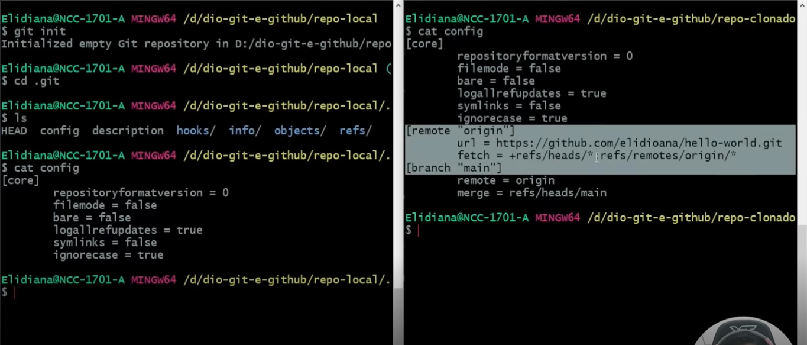

# Criando e clonando repositorios
## Existem duas formas de obter um repositorios Git na sua Máquina
- Transformando um diretório local que não está sob controle de versão, num repositorio Git;
- Clonando um repositório Git existente.
- 
- 
- 
- 