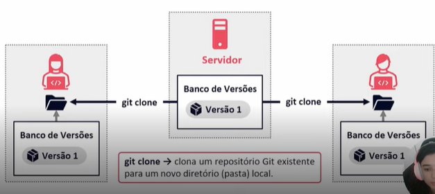

# O que é GIT?
- Sistema de controle de versõ distribuído
- - Gratuito e Open Source (código berto);
- - Ramificações (branching) e fusões (merging) eficientes;
- - Leve e rápido.
- Após conflitos com a comunidade, o BitKeeper rescinde a lincença gratuira. O que leva a Linux Torvalds, o criador 
  do Linux, e sua equipe desenvolverem sua própria ferramenta, o Git.

## Fluxo básico no git
- git clone -> clona um repositório Git existente para um novo diretório (pasta) local.
- - 
- git commit -> grava alterações no repositório.
- git pull -> "puxa" as alterações do repositório remoto para o local (busca e mescla).
- git push -> "empurra" as alterações do repositório local para o remoto.