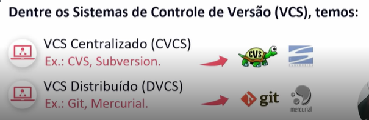
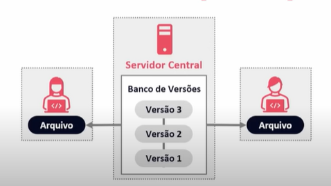
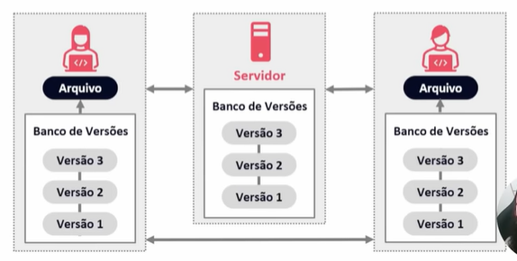

# Sistemas de controle de versão
## Controlam as versões de um arquivo ao longo do tempo.
- registra o histórico de atualizações de um arquivo;
- Gerencia quais foram as alterações, a data, autor, etc;
- Organização, controle e segurança.
- Tipo de sistemas de controle de versão
- - 
- VCS centralizado
- - 
- VCS Distribuído 
- - 
- - Clona o repositório completo, o que inclui o his´torico de versões
- - - Cada clone é como um backup
- - - Possibilita um fluco de trabalho flexível
- - - Possibilidade de trabalhar sem conexão à rede.
