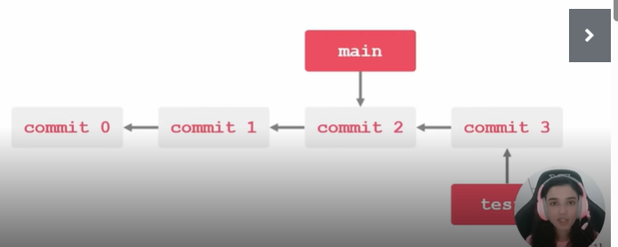
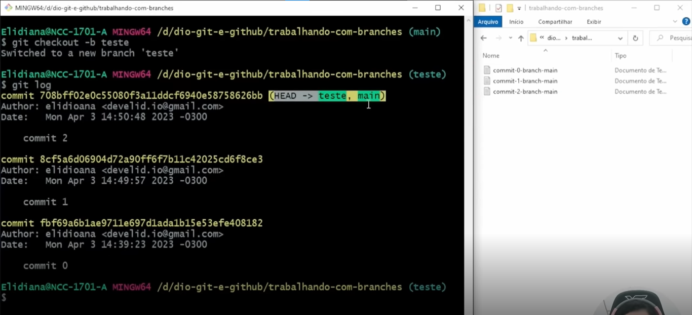
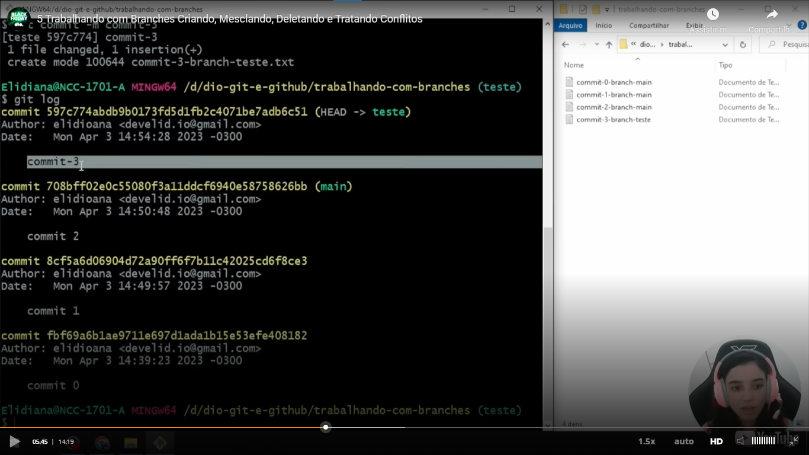
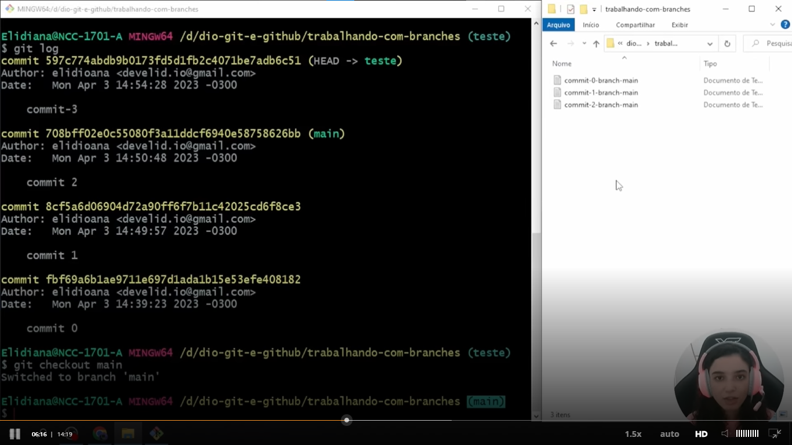
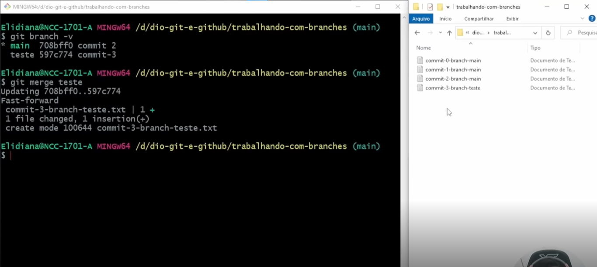
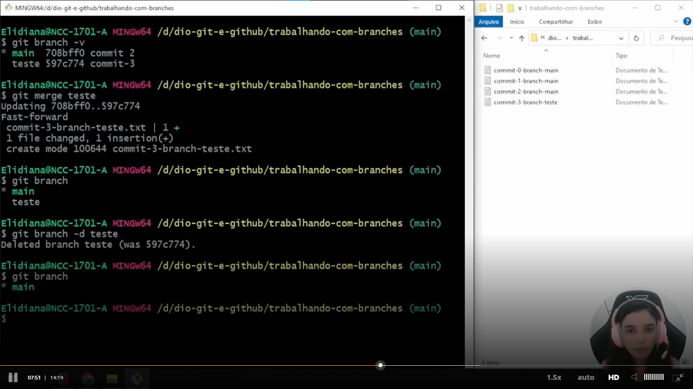
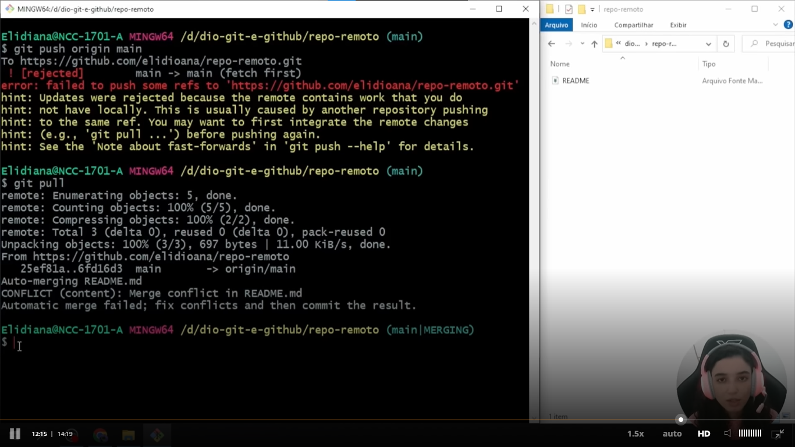
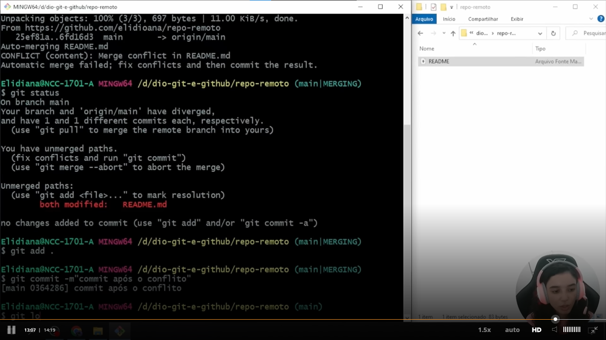

## De maneira simplista, uma Branch (em tradução "Ramo") é uma ramificação do seu projeto
- É um ponteiro móvel para um commit no histórico do repositório;
- Quando você cria uma nova Branch a partir de outra existente, a nova se inicia apontando para o mesmo commit da 
  Branch que estava quando foi criada.
- 
- 
- 
- 
- 
- 
- 
- 
- 